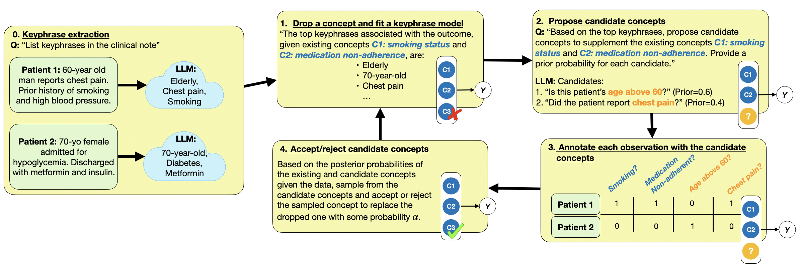

<h1 align="center"> 🧑🏻‍💻 BC-LLM - Reproduction and Analysis </h1>
<p align="center"> <b>Bayesian Concept Bottleneck Models with LLM Priors by</b>  <a href="https://arxiv.org/abs/2410.15555">Feng et al. 2024</a>. 
</p>

<p align="center">
  
</p>  



> This is the work done on a paper published by Feng et al. The repository proposes a bottleneck model based on concepts extracted by an LLM. Different models like the black box ResNET50 with IMAGENET1K_V2 weights are compared with the bottleneck.
The only model allowed to work on CUB are built by OpenAI. The authors claim that the open source Llama can be used too, which should not be possible, at least in Italy, where the only Llama models available are "language only".

### What happens with CUB

1 - Building of "label.csv" which organizes the overal data into a subset of 179 elements, labels and four basic concepts.

2 - Divides the data in train and test (10% of the data) train_test_split.py

3 - Trains ResNet50 for multiclass classification

4 - Tries to use an LLM for extracting high level features from the images, but then the code stops.
4 - Tries to use an LLM for extracting high level features from the images, but then the code stops.

### Starting the experiment

**Requirements**

1 - Install Python 3.12.9 > conda install python=3.12

2 - Install all packages from requirements.txt > pip install -r requirements.txt

**Cub Dataset settings**

1 - Download the CUB dataset from here: https://data.caltech.edu/records/65de6-vp158

2 - Rename CUB as data/CUB_200_2011

3 - Move "data" folder into exp_cub_birds_existing

**Access Models**

Create a .env with the access token for HuggingFace
HF_ACCESS_TOKEN=TOKEN

**Running the code**

Type on terminal > scons exp_cub_birds_existing

### Citation of the original authors
This analysis is done on:

```r
@misc{feng2024bcllm,
      title={Bayesian Concept Bottleneck Models with LLM Priors}, 
      author={Jean Feng and Avni Kothari and Luke Zier and Chandan Singh and Yan Shuo Tan},
      year={2024},
      eprint={2410.15555},
      archivePrefix={arXiv},
      primaryClass={cs.LG},
      url={https://arxiv.org/abs/2410.15555}, 
}
```
